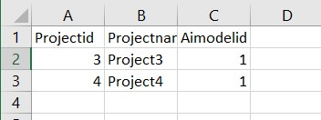

<p align="center"><b>МОНУ НТУУ КПІ ім. Ігоря Сікорського ФПМ СПіСКС</b></p>
<p align="center">
<b>Звіт з лабораторної роботи 5</b><br/>
"Робота з базою даних"<br/>
дисципліни "Вступ до функціонального програмування"
</p>
<p align="right"><b>Студент</b>: Гусельніков Антон Олексійович КВ-12</p>
<p align="right"><b>Рік</b>: 2024</p>

## Загальне завдання
В роботі необхідно реалізувати утиліти для роботи з базою даних, заданою за варіантом
(п. 5.1.1). База даних складається з кількох таблиць. Таблиці представлені у вигляді CSV
файлів. При зчитуванні записів з таблиць, кожен запис має бути представлений певним
типом в залежності від варіанту: структурою, асоціативним списком або геш-таблицею.
1. Визначити структури або утиліти для створення записів з таблиць (в залежності від
типу записів, заданого варіантом).
2. Розробити утиліту(-и) для зчитування таблиць з файлів.
3. Розробити функцію select , яка отримує на вхід шлях до файлу з таблицею, а
також якийсь об'єкт, який дасть змогу зчитати записи конкретного типу або
структури. Це може бути ключ, список з якоюсь допоміжною інформацією, функція і
т. і. За потреби параметрів може бути кілька. select повертає лямбда-вираз,
який, в разі виклику, виконує "вибірку" записів з таблиці, шлях до якої було
передано у select . При цьому лямбда-вираз в якості ключових параметрів може
отримати на вхід значення полів записів таблиці, для того щоб обмежити вибірку
лише заданими значеннями (виконати фільтрування). Вибірка повертається у
вигляді списку записів.
4. Написати утиліту(-и) для запису вибірки (списку записів) у файл.

5. Написати функції для конвертування записів у інший тип (в залежності від
варіанту):
структури у геш-таблиці
геш-таблиці у асоціативні списки
асоціативні списки у геш-таблиці

6. Написати функцію(-ї) для "красивого" виводу записів таблиці.
## Варіант 6
| База даних             | Тип записів          |
|------------------------|----------------------|
| Проєкти із застосуванням ШІ | Асоціативний список |
## Лістинг реалізації завдання
```lisp
(defun read-table-from-csv (path)
  (when (stringp path)
    (with-open-file (s path :if-does-not-exist :error)
      (do ((table '())
           (line (read-line s nil nil) (read-line s nil nil)))
          ((null line) (reverse table))
        (setf table  (cons (uiop:split-string (remove #\Return line :count nil) :separator '(#\;)) table))))))

(defun table-to-alist (table)
  (mapcan (lambda (x) (list (reverse (pairlis (car table) x)))) (cdr table)))

(defun set-types (elems types)
  (cond
    ((null elems) '())
    ((eql (car types) 'n) (cons (cons (intern (string-upcase (car (car elems))) :keyword)  (read-from-string (cdr (car elems)))) (set-types (cdr elems) (cdr types))))
    (t (cons (cons (intern (string-upcase (car (car elems))) :keyword)  (cdr (car elems))) (set-types (cdr elems) (cdr types))))
    )
  )

(defun select (path conf-list)                                   ; conf-list має бути розміром з кількість стовпців у таблиці. Приймає список символів.
                                                                 ; У цьому списку розрізняються тільки n та НЕ n. (n - для чисел, інші символи для string)
  (let ((alist (table-to-alist (read-table-from-csv path))))
    (when (eql (length (car alist)) (length conf-list))
      (let ((typed-alist  (mapcan (lambda (x) (list  (set-types x conf-list))) alist))
            (result '()))
        (lambda (&key key key-value)
          (dolist (var typed-alist)
            (if (and key key-value)
                (when (equal (cdr (assoc key var))  key-value)
                  (setf result (cons var result)))
                (setf result (cons var result))))
          (reverse result))))))

(defun is-line-empty (line)
  (if (string= line "")
      nil
      ";"))

(defun check-string (elem)
  (if (stringp elem)
      elem
      (write-to-string elem))
  )

(defun write-to-csv (path typed-alist)
  (with-open-file (s path :direction :output :if-exists :supersede :if-does-not-exist :create)
    (let ((line ""))
      (dolist (var (car typed-alist))
        (setf line (concatenate 'string line (is-line-empty line) (string-capitalize (string (car var)))))
       
        )
      (format s "~a~%" line)
      (setf line "")
      (dolist (var typed-alist)
        (dolist (elem var)
          (setf line (concatenate 'string line (is-line-empty line) (check-string (cdr elem))))
          )
        (format s "~a~%" line)
        (setf line "")
        ))
    )
  )

(defun alist-to-hash (alist)
  (let ((result '())
        (ht nil))
    (dolist (var alist)
      (setf ht (make-hash-table :test 'eq))
      (dolist (elem var)
        (setf (gethash (car elem) ht) (cdr elem))
        )
      (setf result (cons ht result))
      )
    (reverse result))
 
  )

(defun print-alist (alist)
  (dolist (var (car alist))
    (format t "~15a " (string-capitalize (string (car var))))
    
    )
  (format t "~%")
  (dolist (var alist)
    (dolist (elem var)
      (format t "~15s " (cdr elem))
      )
    (format t "~%")
    )
  )

(defun print-hash-list (hash-list)
  (let ((keys))
    (maphash (lambda (key value)
               (push key keys))
             (car hash-list))
    (dolist (elem keys)
      (format t "~15a " (string-capitalize (string elem)))
      )
    (format t "~%")
    (dolist (elem hash-list)
      (maphash (lambda (key value)
                (format t "~15s " value))
               elem)
      (format t "~%"))
    )
 
  )
```
### Тестові набори та утиліти
```lisp
(defun check-function (name func expected &rest args)
  (let ((result (apply func args)))
    (format t "Result ~a:~% ~a~%" name result)
    (format t "~:[FAILED~;passed~]... ~a~%" (equalp result expected) name)))

(defun test1 ()
  (check-function "Test1" (select "projects/lab5/AIModels.csv" '(n s)) '(((:MODELID . 1) (:AIMODEL . "Model1")) ((:MODELID . 2) (:AIMODEL . "Model2"))((:MODELID . 3) (:AIMODEL . "Model3"))))
  (check-function "Test2" (select "projects/lab5/Projects.csv" '(n f n)) '(((:PROJECTID . 3) (:PROJECTNAME . "Project3") (:AIMODELID . 1))((:PROJECTID . 4) (:PROJECTNAME . "Project4") (:AIMODELID . 1)))
                  :key :aimodelid :key-value 1)
  )


(defun test2 ()
  (let ((ht1 (list (make-hash-table :test 'eq)))
        (ht2 (list (make-hash-table :test 'eq))))
    (setf (gethash :ModelID (car ht1)) 1)
    (setf (gethash :AIModel (car ht1)) "Model1")

    (setf (gethash :ProjectID (car ht2)) 2)
    (setf (gethash :ProjectName (car ht2)) "Project2")
    (setf (gethash :AIModelID (car ht2)) 3)
    
    (check-function "Test1" 'alist-to-hash ht1 (funcall (select "projects/lab5/AIModels.csv" '(n s)) :key :modelid :key-value 1))
    (check-function "Test2" 'alist-to-hash ht2 (funcall (select "projects/lab5/Projects.csv" '(n s n)) :key :projectname :key-value "Project2"))
    ))

(defun test-print ()
  (format t "Test Print Alist: ~%")
  (print-alist  (funcall  (select "projects/lab5/AIModels.csv" '(n s))))
  (format t "~%Test Print Hash-list: ~%")
  (print-hash-list (alist-to-hash (funcall (select "projects/lab5/Projects.csv" '(n s n))))))

(defun test-write-csv ()
  (write-to-csv "projects/lab5/Projects1.csv" '(((:PROJECTID . 3) (:PROJECTNAME . "Project3") (:AIMODELID . 1))
                                               ((:PROJECTID . 4) (:PROJECTNAME . "Project4") (:AIMODELID . 1))))
  )
```
### Тестування
```lisp
CL-USER> (test1)
Result Test1:
 (((MODELID . 1) (AIMODEL . Model1)) ((MODELID . 2) (AIMODEL . Model2))
  ((MODELID . 3) (AIMODEL . Model3)))
passed... Test1
Result Test2:
 (((PROJECTID . 3) (PROJECTNAME . Project3) (AIMODELID . 1))
  ((PROJECTID . 4) (PROJECTNAME . Project4) (AIMODELID . 1)))
passed... Test2
NIL

CL-USER> (test2)
Result Test1:
 (#<HASH-TABLE :TEST EQ :COUNT 2 {1005224193}>)
passed... Test1
Result Test2:
 (#<HASH-TABLE :TEST EQ :COUNT 3 {10052280E3}>)
passed... Test2
NIL

CL-USER> (test-print)
Test Print Alist: 
Modelid         Aimodel         
1               "Model1"        
2               "Model2"        
3               "Model3"        

Test Print Hash-list: 
Aimodelid       Projectname     Projectid       
1               "Project1"      2               
2               "Project2"      3               
3               "Project3"      1               
4               "Project4"      1               
NIL

CL-USER> (test-write-csv)
NIL
```
<p align="left">

</p>
